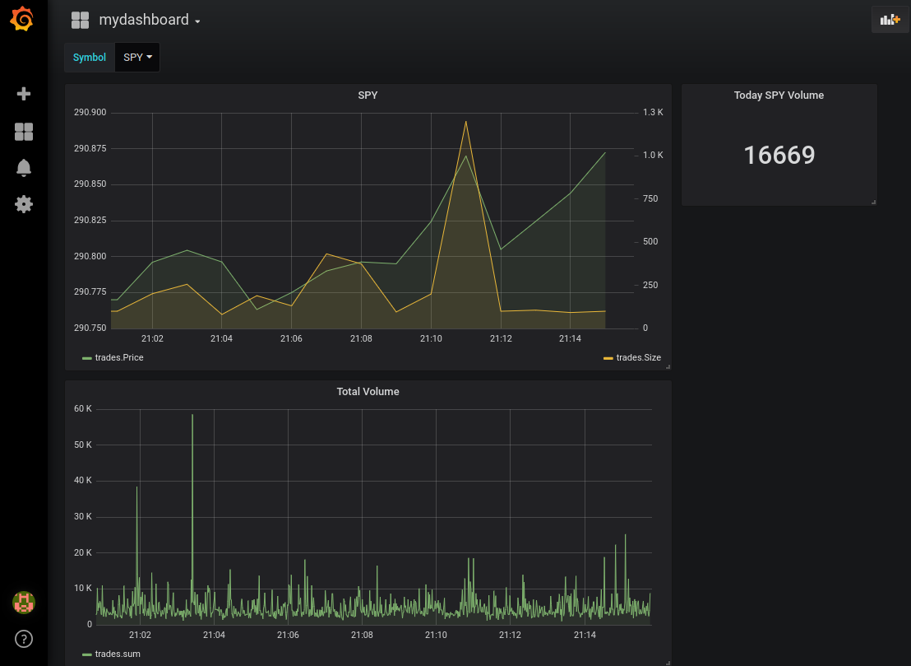

# IEX Stream

[](https://travis-ci.org/zhy0/iex_stream)

Stream free trade data from [IEX API](https://iextrading.com/developer/docs/)
to [InfluxDB](https://github.com/influxdata/influxdb) and use
[Grafana](https://github.com/grafana/grafana) to display charts.




## Usage

Make sure recent versions of [Docker](https://docs.docker.com/install/) and [Docker
Compose](https://docs.docker.com/compose/install/) are installed.
Clone the repo

```bash
git clone https://github.com/zhy0/iex_stream.git
cd iex_stream
```
and run

```bash
docker-compose up
```

This will start `stream.js`, InfluxDB and Grafana in separate containers.
Once everything is running, you can visit `localhost:3000` to view the
charts. Login to Grafana using the standard

* Username: admin
* Password: admin

and navigate to 'Dashboards > Manage > mydashboard'.


## Notes

* To persist the data, you should mount the InfluxDB container
data, see `docker-compose.prod.yml`.

* `stream.js` listens for all trade executions on IEX using the [Last endpoint](https://iextrading.com/developer/docs/#last).
* It writes data to database in batches of 500 data points and once every 5 seconds.
